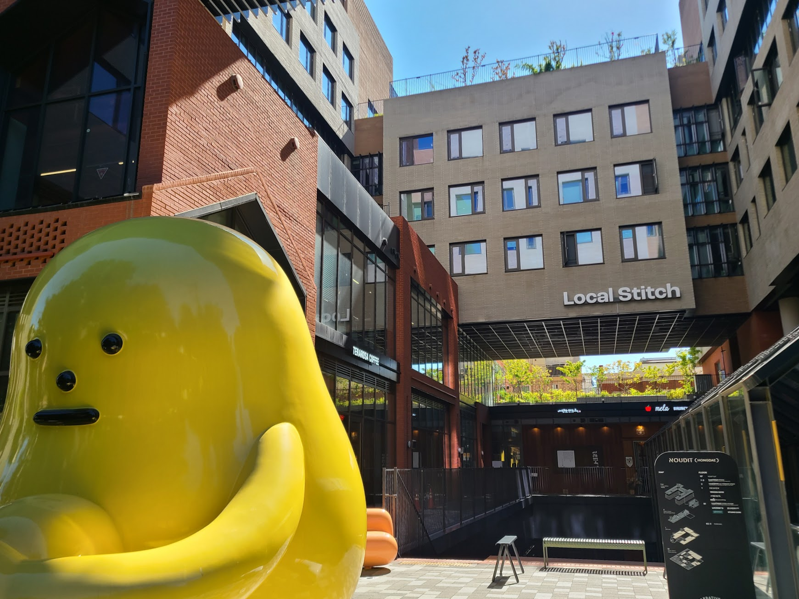
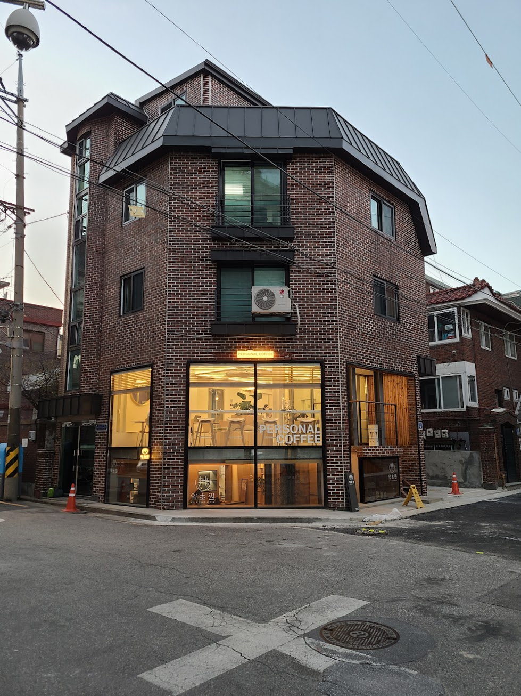
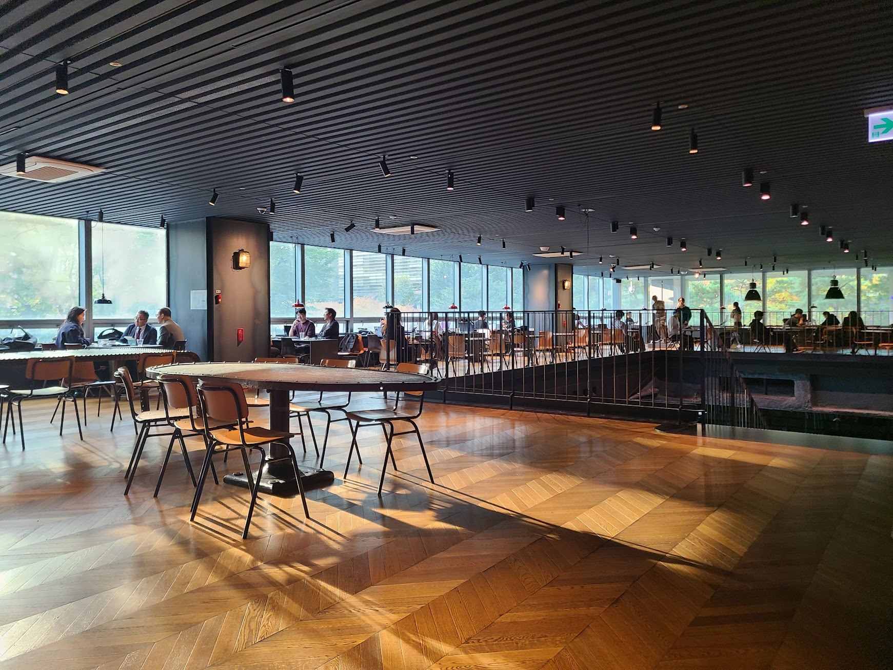

## 문제 1

Q: 다음 이미지에 대한 설명 중 옳지 않은 것은 무엇인가요?
- (1) 많은 사람들이 실내 행사에 참여하고 있습니다.
- (2) 사람들이 테이블에 앉아 노트북을 사용하고 있습니다.
- (3) 벽에는 'DIVE 2024 IN BUSAN'이라는 문구가 보입니다.
- (4) 참석자들은 모두 검은 옷을 입고 있습니다.

Listening: Which of the following descriptions of the image is incorrect?
- (1) Many people are attending an indoor event.
- (2) People are sitting at tables using laptops.
- (3) The phrase 'DIVE 2024 IN BUSAN' is visible on the wall.
- (4) All attendees are wearing black clothes.

정답: (4) 참석자들은 다양한 색상의 옷을 입고 있습니다.

---------------------

## 문제 2

Q: 다음 이미지에 대한 설명 중 옳지 않은 것은 무엇인가요?
- (1) 노란색 조형물이 이미지의 왼쪽에 있습니다.
- (2) 건물에 "Local Stitch"라는 글자가 보입니다.
- (3) 벽돌 건물은 없으며 현대적인 건물로만 이루어져 있습니다.
- (4) 햇빛이 건물에 비치고 있습니다.

Listening: Which of the following descriptions of the image is incorrect?
- (1) A yellow sculpture is on the left side of the image.
- (2) The words "Local Stitch" are visible on a building.
- (3) There are no brick buildings, only modern ones.
- (4) Sunlight is shining on the building.

정답: (3) 벽돌 건물도 이미지에 포함되어 있습니다.

---------------------

## 문제 3

Q: 다음 이미지에 대한 설명 중 옳지 않은 것은 무엇인가요?

- (1) 카페의 실내 모습이 담겨 있습니다.
- (2) 벽은 밝은 노란색으로 칠해져 있습니다.
- (3) 카운터 뒤에는 두 명의 직원이 있습니다.
- (4) 모든 테이블은 검은색입니다.

Listening: Which of the following descriptions of the image is incorrect?

- (1) It shows the interior of a café.
- (2) The wall is painted bright yellow.
- (3) There are two staff members behind the counter.
- (4) All the tables are black.

정답: (4) 모든 테이블이 검은색이 아닌 흰색입니다.

---------------------

## 문제 4

Q: 다음 이미지에 대한 설명 중 옳지 않은 것은 무엇인가요?
- (1) 건물의 외관은 벽돌로 되어 있습니다.
- (2) 건물 앞에 주황색 원뿔이 놓여 있습니다.
- (3) 1층 창문에 "PERSONAL COFFEE"라는 문구가 보입니다.
- (4) 건물은 2층 구조로 되어 있습니다.

Listening: Which of the following descriptions of the image is incorrect?
- (1) The exterior of the building is made of brick.
- (2) There is an orange cone placed in front of the building.
- (3) The first-floor window has the text "PERSONAL COFFEE" visible.
- (4) The building has a two-story structure.

정답: (4) 건물은 3층 구조로 되어 있습니다.

---------------------

## 문제 5

Q: 다음 이미지에 대한 설명 중 옳지 않은 것은 무엇인가요?
- (1) 다양한 종류의 빵이 진열되어 있습니다.
- (2) 가격표에 모든 빵의 가격이 3.2입니다.
- (3) 점원이 모자를 쓰고 있습니다.
- (4) 유리 진열장 안에 많은 빵이 쌓여 있습니다.

Listening: Which of the following descriptions of the image is incorrect?
- (1) Various types of bread are displayed.
- (2) All the bread prices on the price tags are 3.2.
- (3) The worker is wearing a hat.
- (4) There are many loaves of bread stacked in the glass display case.

정답: (2) 가격표에 모든 빵의 가격이 3.2가 아니라 다양한 가격이 있습니다.

---------------------

## 문제 6

Q: 다음 이미지에 대한 설명 중 옳지 않은 것은 무엇인가요?

- (1) 사람들이 공사 중인 모습이 보입니다.
- (2) '뉴트리코어'라는 간판이 보입니다.
- (3) 나무 벤치가 나무 그늘 아래 놓여져 있습니다.
- (4) '베이커리 카페'는 지금 영업 중입니다.

Listening: Which of the following descriptions of the image is incorrect?

- (1) People are seen working on construction.
- (2) A sign for "뉴트리코어" is visible.
- (3) A wooden bench is placed under the tree shade.
- (4) The "베이커리 카페" is currently open for business.

정답: (4) '베이커리 카페'는 지금 영업 중이지 않습니다. 공사가 진행 중입니다.

---------------------

## 문제 7

Q: 다음 이미지에 대한 설명 중 옳지 않은 것은 무엇인가요?
- (1) 넓은 창문을 통해 자연광이 들어오고 있습니다.
- (2) 바닥은 나무 재질로 되어 있습니다.
- (3) 의자들이 모두 창가에 배치되어 있습니다.
- (4) 몇몇 사람들이 테이블에 앉아 있습니다.

Listening: Which of the following descriptions of the image is incorrect?
- (1) Natural light is coming through large windows.
- (2) The floor is made of wood.
- (3) The chairs are all arranged by the window.
- (4) Some people are sitting at tables.

정답: (3) 의자들이 모두 창가에 배치되어 있지 않습니다.

---------------------

## 문제 8

Q: 다음 이미지에 대한 설명 중 옳지 않은 것은 무엇인가요?

- (1) 사람들이 버스 앞에 모여 있습니다.
- (2) 한 남자가 전화 통화를 하고 있습니다.
- (3) 커피숍 창문 너머로 장면을 보고 있습니다.
- (4) 나무들은 가을 느낌의 붉은 잎사귀를 가지고 있습니다.

Listening: Which of the following descriptions of the image is incorrect?

- (1) People are gathered in front of a bus.
- (2) A man is talking on the phone.
- (3) The scene is viewed through a coffee shop window.
- (4) The trees have red leaves, giving an autumn vibe.

정답: (4) 나무들은 가을 느낌의 붉은 잎사귀가 아닌 녹색 잎사귀를 가지고 있습니다.

---------------------

